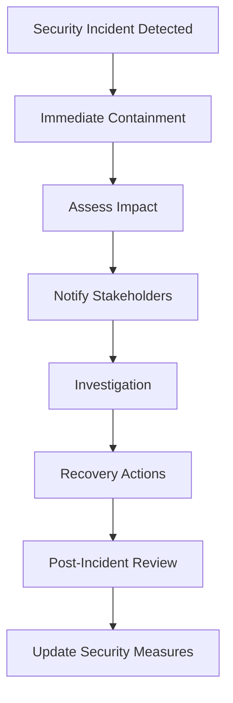

# Security Policy

TGPro takes security seriously. This document outlines our security practices, how to report vulnerabilities, and security best practices for users.

## 🔒 Security Overview

### Current Security Measures

TGPro implements multiple layers of security:

#### 🛡️ Data Protection
- **AES-256 Encryption**: All sensitive data (API credentials, tokens) encrypted at rest
- **JWT Authentication**: Secure token-based authentication with proper expiration
- **Session Management**: Encrypted session storage with automatic cleanup
- **Input Validation**: Comprehensive validation using Pydantic models
- **Password Hashing**: Secure password hashing using industry standards

#### 🚧 Network Security
- **HTTPS Only**: All communications encrypted in transit
- **CORS Protection**: Configurable Cross-Origin Resource Sharing policies
- **Rate Limiting**: Protection against brute force and DDoS attacks
- **API Key Authentication**: Bearer token authentication for all API endpoints
- **Request Sanitization**: All user inputs sanitized to prevent injection attacks

#### 🔐 Authentication Security
- **Multi-Factor Authentication**: Support for Telegram 2FA
- **Secure Session Handling**: Automatic session expiration and cleanup
- **Token Refresh**: Automatic token refresh to minimize exposure
- **Account Lockout**: Protection against brute force login attempts

## 📊 Supported Versions

Security updates are provided for the following versions:

| Version | Supported          | End of Life |
| ------- | ------------------ | ----------- |
| 3.1.x   | ✅ Full Support    | TBD         |
| 3.0.x   | ✅ Security Only   | 2025-12-31  |
| 2.x.x   | ❌ No Support     | 2024-12-31  |
| 1.x.x   | ❌ No Support     | 2024-06-30  |

## 🚨 Reporting Security Vulnerabilities

### How to Report

If you discover a security vulnerability, please report it responsibly:

#### 🔴 Critical Vulnerabilities
For **critical vulnerabilities** (RCE, data breach, authentication bypass):

1. **DO NOT** create a public issue
2. **Email**: security@tgpro.dev (if available) or use private disclosure
3. **Include**: Detailed description, steps to reproduce, impact assessment
4. **Timeline**: We aim to respond within 24 hours

#### 🟡 Non-Critical Vulnerabilities
For **non-critical vulnerabilities** (information disclosure, DoS):

1. Create a **private security advisory** on GitHub
2. Or email with full details
3. **Timeline**: Response within 72 hours

### What to Include

Please provide the following information:

- **Type of vulnerability** (e.g., XSS, SQL injection, etc.)
- **Location** (file, function, endpoint affected)
- **Impact** assessment (what can an attacker do?)
- **Steps to reproduce** with detailed instructions
- **Proof of concept** code or screenshots
- **Suggested fix** if you have one
- **Your contact information** for follow-up

### What NOT to Do

- ❌ **Don't** publicly disclose the vulnerability before we've had a chance to fix it
- ❌ **Don't** access or modify data that doesn't belong to you
- ❌ **Don't** perform destructive testing (DoS, data deletion, etc.)
- ❌ **Don't** social engineer our team or users
- ❌ **Don't** perform testing on production systems without permission

## 🛠️ Security Response Process

### Our Response Timeline

1. **Acknowledgment**: Within 24 hours (critical) or 72 hours (non-critical)
2. **Initial Assessment**: Within 48 hours
3. **Investigation**: 3-7 days depending on complexity
4. **Fix Development**: 1-14 days depending on severity
5. **Testing**: 1-3 days
6. **Deployment**: Coordinated with reporter
7. **Public Disclosure**: 90 days after fix deployment (negotiable)

### Response Actions

Depending on the severity, we may:
- Issue immediate hotfix for critical vulnerabilities
- Release security patch in next scheduled update
- Provide temporary workarounds
- Update documentation with security recommendations
- Notify affected users if necessary

## 🔧 Security Best Practices for Users

### Deployment Security

#### 🌐 Production Deployment
- **Use HTTPS**: Always deploy with SSL/TLS certificates
- **Secure Headers**: Implement security headers (HSTS, CSP, etc.)
- **Regular Updates**: Keep the application and dependencies updated
- **Monitor Logs**: Implement log monitoring for suspicious activity
- **Backup Strategy**: Regular encrypted backups with tested restore procedures

#### 🔑 Credential Management
- **Strong Passwords**: Use strong, unique passwords for all accounts
- **2FA Enabled**: Enable two-factor authentication where available
- **API Key Security**: Never hardcode API keys, use environment variables
- **Regular Rotation**: Rotate API keys and tokens regularly
- **Access Control**: Implement principle of least privilege

#### 🗄️ Database Security
- **MongoDB Security**: Enable authentication and use SSL connections
- **Network Isolation**: Use private networks and firewalls
- **Regular Backups**: Encrypted backups stored securely
- **Access Logging**: Monitor database access and queries
- **Connection Limits**: Implement connection limits and timeouts

### Application Security

#### 🔒 Authentication Security
```python
# Example: Secure JWT configuration
JWT_SETTINGS = {
    "algorithm": "HS256",
    "expire_minutes": 30,  # Short expiration
    "refresh_expire_days": 7,
    "secret_key": os.getenv("JWT_SECRET_KEY"),  # From environment
}
```

#### 🛡️ Input Validation
```python
# Example: Proper input validation
from pydantic import BaseModel, validator

class UserInput(BaseModel):
    message: str
    
    @validator('message')
    def validate_message(cls, v):
        if len(v) > 1000:
            raise ValueError('Message too long')
        # Sanitize input
        return html.escape(v.strip())
```

#### 🚫 Rate Limiting
```python
# Example: Rate limiting configuration
RATE_LIMITS = {
    "login": "5/minute",
    "api_calls": "100/minute",
    "message_send": "10/minute",
}
```

### Infrastructure Security

#### 🌐 Network Security
- **Firewall Rules**: Restrict access to necessary ports only
- **VPN Access**: Use VPN for administrative access
- **Load Balancer**: Use load balancer with SSL termination
- **DDoS Protection**: Implement DDoS protection services
- **Network Monitoring**: Monitor network traffic for anomalies

#### 📊 Monitoring and Logging
```yaml
# Example: Security monitoring configuration
monitoring:
  failed_logins:
    threshold: 5
    window: "5m"
    action: "block_ip"
  
  suspicious_activity:
    - multiple_api_keys
    - unusual_traffic_patterns
    - failed_authentication_attempts
    
  log_retention: "90d"
  log_encryption: true
```

## 🚨 Security Incidents

### If You Suspect a Breach

If you suspect your TGPro installation has been compromised:

1. **Immediate Actions**:
   - Change all passwords and API keys
   - Review access logs for suspicious activity
   - Temporarily disable the application if necessary
   - Document the incident

2. **Investigation**:
   - Check system logs for unauthorized access
   - Review database for data modifications
   - Analyze network traffic logs
   - Identify the attack vector

3. **Recovery**:
   - Update to the latest version
   - Apply all security patches
   - Restore from clean backups if necessary
   - Implement additional security measures

4. **Reporting**:
   - Report the incident to appropriate authorities if required
   - Notify users if their data may have been compromised
   - Document lessons learned

### Incident Response Plan



## 📋 Security Checklist

### Pre-Deployment Security Checklist

- [ ] **Credentials**: All default passwords changed
- [ ] **SSL/TLS**: HTTPS enabled with valid certificates
- [ ] **Firewall**: Only necessary ports exposed
- [ ] **Updates**: All dependencies updated to latest secure versions
- [ ] **Backup**: Backup and recovery procedures tested
- [ ] **Monitoring**: Security monitoring and alerting configured
- [ ] **Documentation**: Security procedures documented
- [ ] **Training**: Team trained on security procedures

### Regular Security Maintenance

- [ ] **Monthly**: Review access logs and user permissions
- [ ] **Quarterly**: Update dependencies and security patches
- [ ] **Annually**: Security audit and penetration testing
- [ ] **As Needed**: Respond to security advisories

## 📚 Security Resources

### Educational Resources
- [OWASP Top 10](https://owasp.org/www-project-top-ten/)
- [FastAPI Security](https://fastapi.tiangolo.com/tutorial/security/)
- [React Security Best Practices](https://snyk.io/blog/10-react-security-best-practices/)
- [MongoDB Security Checklist](https://docs.mongodb.com/manual/administration/security-checklist/)

### Security Tools
- **Static Analysis**: CodeQL, SonarQube, Bandit (Python)
- **Dependency Scanning**: Snyk, Dependabot, Safety (Python)
- **Runtime Security**: SAST, DAST, IAST tools
- **Monitoring**: ELK Stack, Grafana, Prometheus

## 🏆 Security Hall of Fame

We recognize security researchers who responsibly disclose vulnerabilities:

<!-- Future security researchers will be listed here -->

*Become the first security researcher to help improve TGPro's security!*

---

**Remember**: Security is everyone's responsibility. By following these guidelines and reporting vulnerabilities responsibly, you help keep TGPro secure for all users.

For questions about this security policy, please contact the development team.